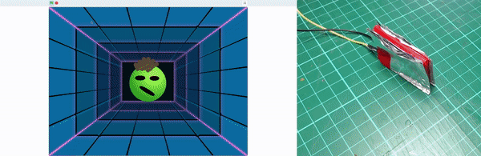
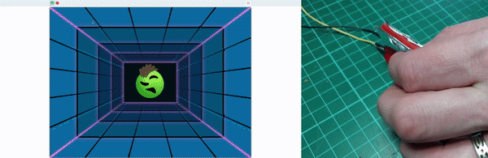

## Introduction

In this project, you will add a button to the [Stress ball](https://projects.raspberrypi.org/en/projects/stress-ball){:target='_blank'} project, so that you can squeeze the **Ball** sprite by pressing a button.

### What you will make

--- no-print ---

--- /no-print ---

--- print-only ---

--- /print-only ---

--- collapse ---
---
title: What you will need
---
### Hardware

+ A Raspberry Pi computer
+ 2 × M-F jumper wires
+ A drinking straw
+ A sheet of aluminium foil
+ Some glue

### Software

+ Scratch 3 Desktop

### Downloads

+ Download the [Stress ball project](http://rpf.io/p/en/stress-ball-get){:target="_blank"} and unzip the folder.

--- /collapse ---

--- collapse ---
---
title: What you will learn
---

+ How to make a simple switch with jumper wires
+ How to use Scratch to detect physical inputs
+ How to make your own button

--- /collapse ---

--- collapse ---
---
title: Additional information for educators
---

You can download the completed project [here](http://rpf.io/p/en/simple-scratch-game-controller-get){:target="_blank"}.

If you need to print this project, please use the [printer-friendly version](https://projects.raspberrypi.org/en/projects/simple-scratch-game-controller/print){:target="_blank"}.

--- /collapse ---
