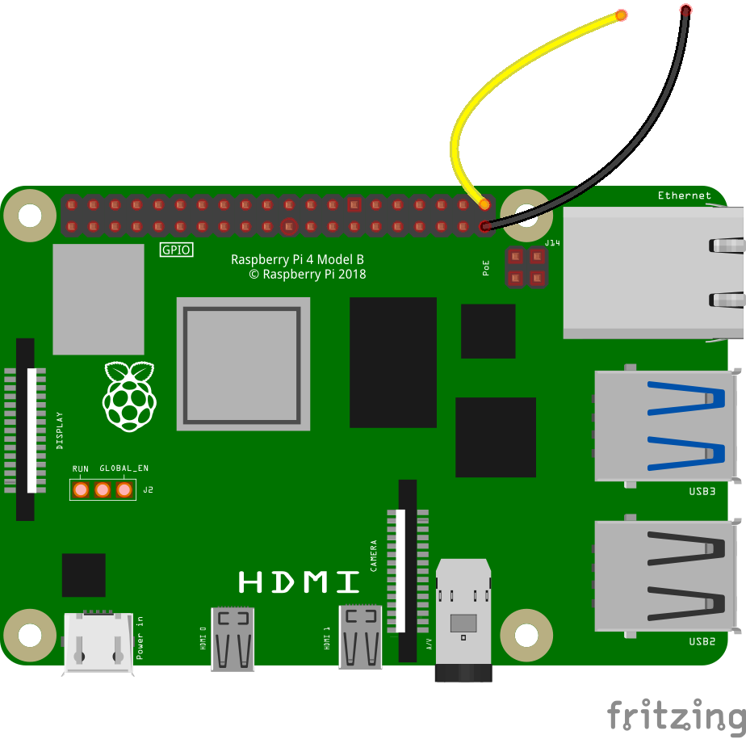

## A simple switch

In this step, you will learn how to move a sprite using a simple switch.

--- task ---

Open Scratch on your Raspberry Pi.


--- /task ---

--- task ---

You should see the Scratch **Cat** sprite on the Stage. Start by using a **keyboard event** to make the sprite move, using the blocks shown below.

```blocks3
when  [space v] key pressed
move (10) steps
```

Click the green flag and then press the <kbd>space</kbd> key a few times to see the sprite move.

--- /task ---

Now you are going to add another **event** that moves the sprite, this time using a homemade physical switch.

A switch works by letting electricity flow from one wire to another wire, by closing a gap to complete a circuit.


You can make your own switch for your Raspberry Pi using two pin-to-socket jumper wires.

--- task ---

Connect one of your jumper wires to a ground pin on the Raspberry Pi.


--- /task ---

--- task ---

Now connect a second pin-to-socket jumper wire to Pin 21 on your Raspberry Pi.



--- /task ---

--- task ---

Add the Raspberry Pi `Simple Electronics`{:class="block3extensions"} extension to your Scratch program.


--- /task ---

--- task ---

Add the following blocks to your script to read the input from your switch.

```blocks3
when button [21 v] is [pressed v] ::hat extension
move (10) steps
```

--- /task ---

--- task ---

Click the green flag, and touch the two jumper wires together. You should see the sprite move ten steps. Break the connection, then touch the wires together again and it should move another ten steps.

--- /task ---

--- save ---
