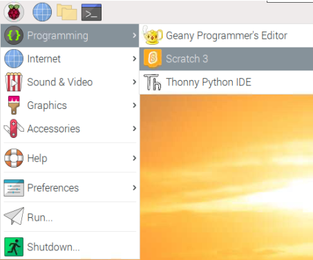
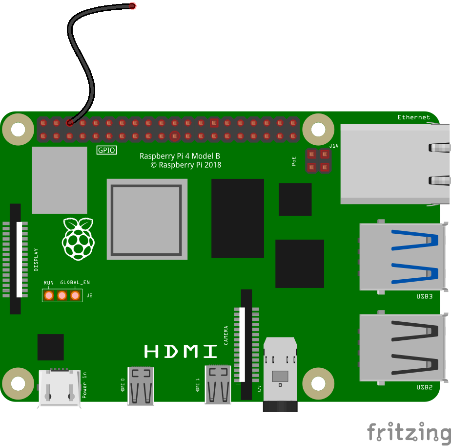
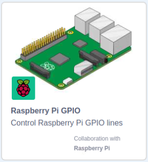

## Step title

In this step you will learn how to move a sprite using a simple switch.

--- task ---

Open Scratch on your Raspberry Pi.



--- /task ---

--- task ---

You should see the Scratch Cat sprite on the stage. Start by using a **keyboard event** to make the sprite move, using the blocks shown below.

```blocks3
when  [space v] key pressed
move (10) steps
```

Click the green flag and then press the **space** key a few times to see the sprite move.

--- /task ---

Now you are going to add another **event** that moves the sprite, using a homemade physical switch.

A switch works by letting electricity flow from one wire to another wire, to complete a circuit.


You can make your own switch for your Raspberry Pi using two M-F jumper leads.

--- task ---

Connect one of your jumper leads to a Ground pin on the Raspberry Pi.



--- /task ---

--- task ---

Now connect a second M-F jumper lead to pin GP17 on your Raspberry Pi.


--- /task ---

--- task ---

Add the **Raspberry Pi GPIO** extension to your Scatch program.



--- /task ---

--- task ---

Add the following blocks to your script to read the input from your switch

```blocks3
when flag clicked
set gpio [17 v] to input [pulled high v] ::extension

when gpio [17 v] is [low v] ::hat extension
move (10) steps
```

--- /task ---

--- task ---

Click the green flag, and touch the two jumper leads together. You should see the sprite move 10 steps. Break the connection and touch the leads together again and it should move another 10 steps.

--- /task ---

--- save ---