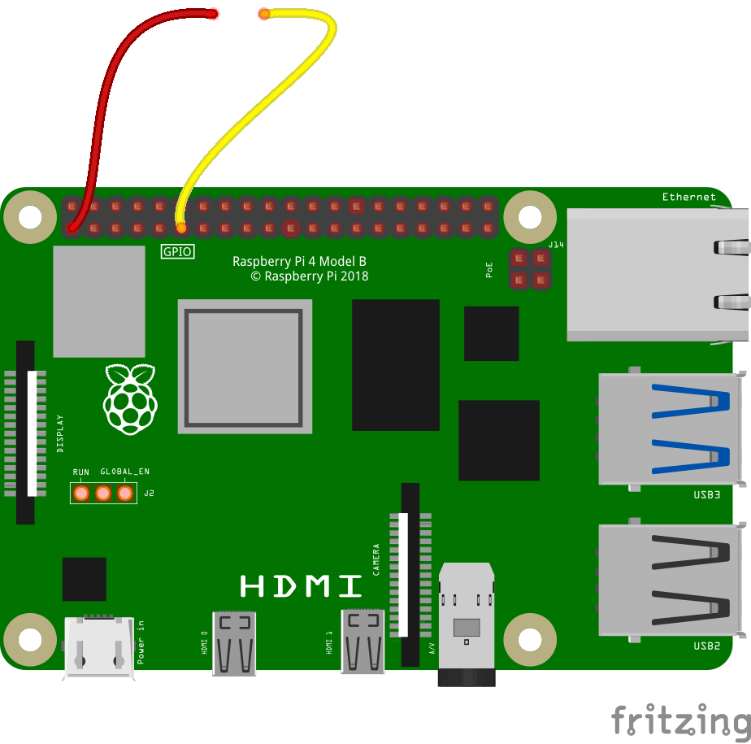

## Highs and Lows

In this step, you will learn about the differences between pins being **High** and pins being **Low**

At the moment, your program looks like this:

```blocks3
when flag clicked
set gpio [17 v] to input [pulled high v] ::extension

when gpio [17 v] is [low v] ::hat extension
move (10) steps
```

You can see that when the **green flag** is clicked, that pin GP17 is set to an **input** and **pulled high**. What does this mean?

--- task ---

Change the dropdowns on the script, to set the pin to an **input** that is **pulled low**. Also change the event block so that is looking for pin GP17 being **High**

```blocks3
when flag clicked
set gpio [17 v] to input [pulled low v] ::extension

when gpio [17 v] is [high v] ::hat extension
move (10) steps
```

Click the green flag and try touching the leads together again. Does the sprite move?

--- /task ---
In the previous project, you learned that an output pin can be set **High** or **Low**. It's either at **3V3** volts or **0V**

Imagine a balloon floating about in a room. It's not touching the ceiling or the floor. When you move the balloon by tapping it a little bit, it's difficult to know whether it goes **High** or **Low**. You could tie the balloon to the floor, and then we'd know that it was **Low**. Or you could tie it to the ceiling, and know that the balloon was **High**. Then when you move the balloon, you know whether it has stopped touching the floor or ceiling.

ANIMATED GIF HERE OF BALLOON

This is what happens when you pull an input pin **Low** or **High**. You are either setting the pin to be at **0V** or setting it to be at **3V3**. Then if the pin's state changes, you know that it has either stopped being **Low** or stopped being **High**

--- task ---

Take the jumper lead that is currently attached to a **ground pin** and move it to a **3V3** pin. A **3V3** pin is always **High**.



--- /task ---

--- task ---

Now try clicking the green flag and touching the jumper leads together, and see what happens.

--- /task ---

Because your homemade switch is now connected to **3V3**, and the input pin is pulled **Low**, when you touch the leads together, the input pin goes from **Low** at **0V** to **High** at **3V3** volts.