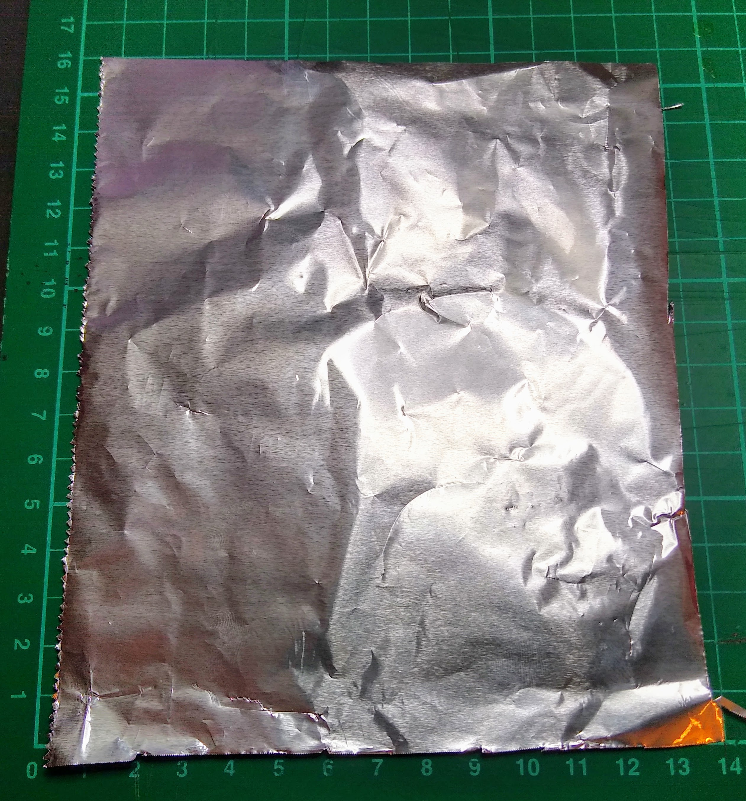
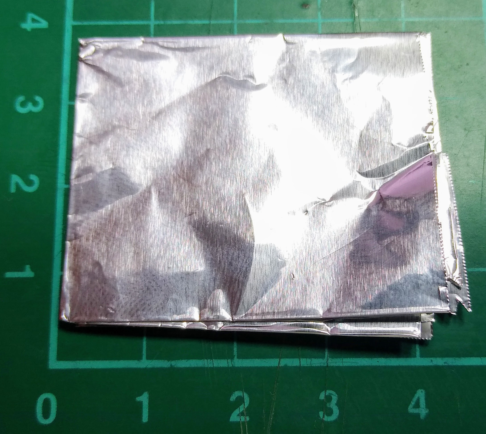
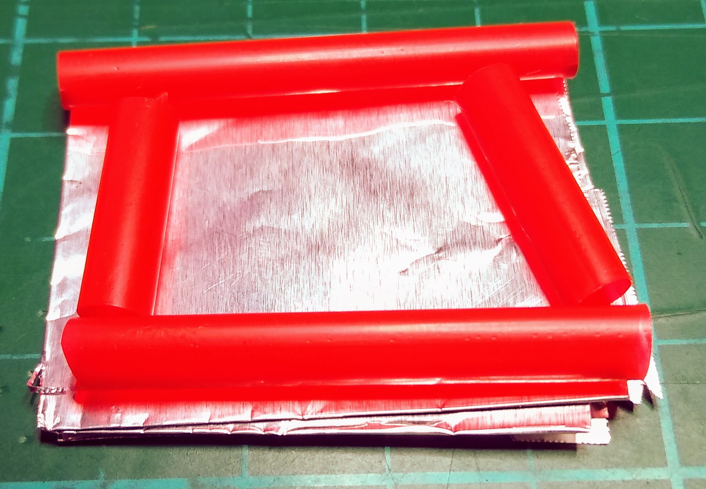
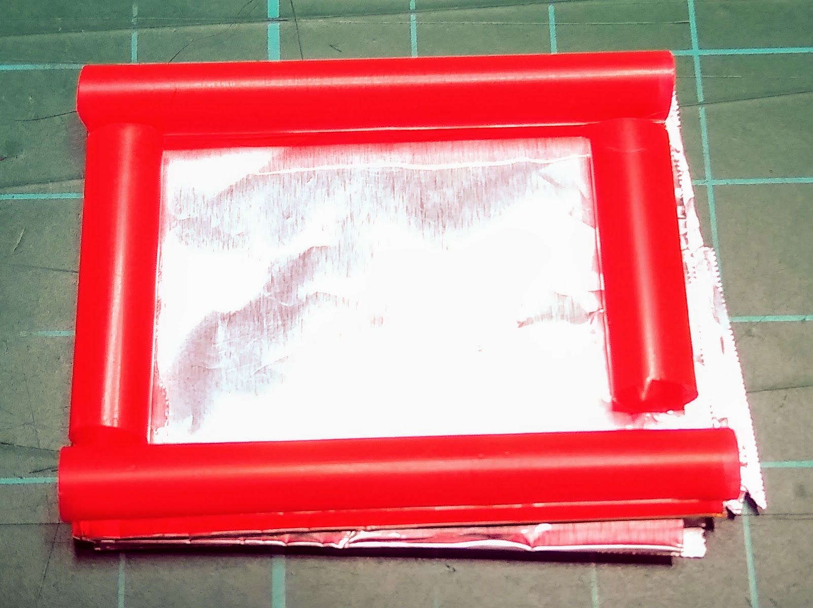
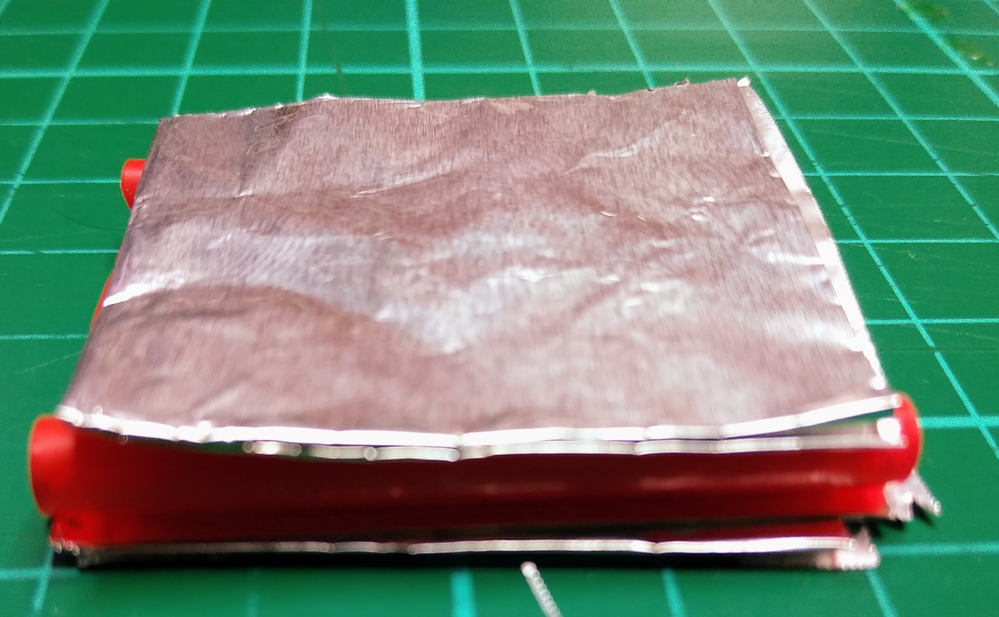
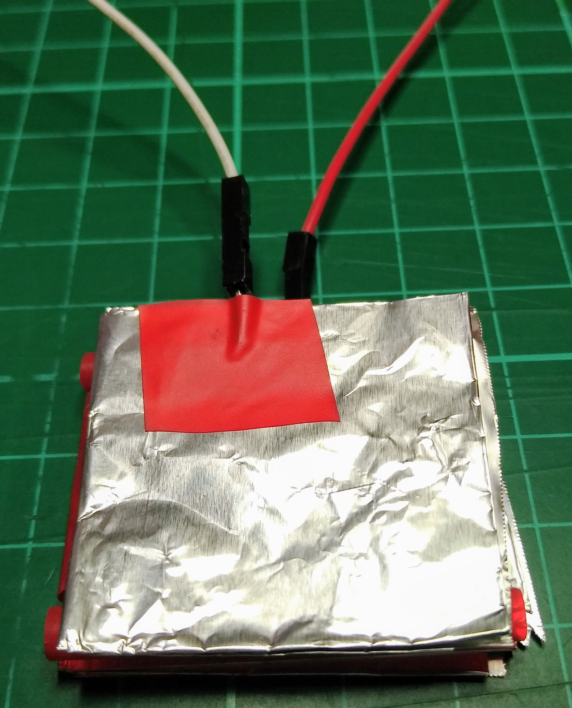

## Make your own button

Now that you have programmed your game, you can make a button that you can push to help relieve some stress.

--- task ---

Cut a sheet of aluminium foil, about 15 cm by 15 cm.

--- /task ---

--- task ---

Fold the foil several times, until you have a square that is about 3 cm by 3 cm.

Repeat this with a second sheet, so that you have two folded squares of foil.

--- /task ---

--- task ---

Take a drinking straw and cut off four pieces, so that you can arrange them in a square around the edges of one piece of the folded foil.

--- /task ---

--- task ---

Glue the straws in place.

--- /task ---

--- task ---

Glue the second foil square on top of the straws to make a 'straw sandwich'.

--- /task ---

--- task ---

Tape one pin-to-socket jumper wire to the bottom square of foil, and the other to the top square of foil. It doesn't matter which wire goes to which square.

--- /task ---

--- task ---

Run your program again. You should now be able to squeeze the **ball** sprite by pushing down firmly in the middle of your button until the two squares of aluminium touch each other.

--- /task ---
