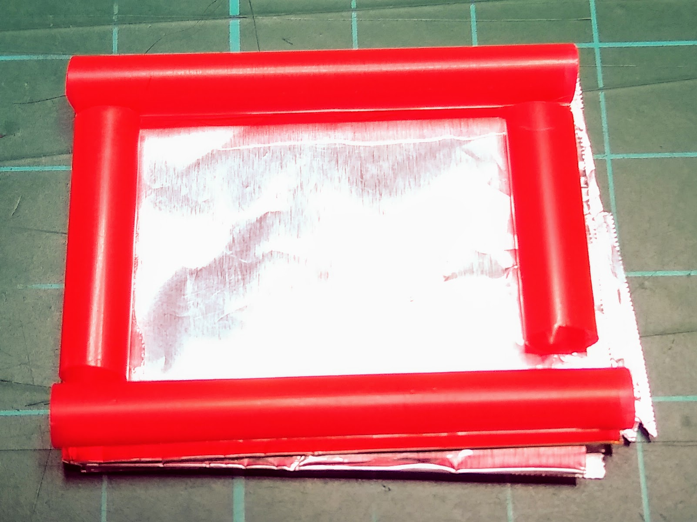

## Make your own button

Now that you have programmed your game, you can make your switch a little easier to use, by making your own push-button.

--- task ---

Cut a sheet of aluminium foil, about 15cm by 15cm.

--- /task ---

--- task ---

Fold the foil several times, until you have a square that is about 3cm by 3cm.

Repeat this, so that you have two folded squares of foil.

--- /task ---

--- task ---

Take a drinking straw and cut off four sections, so that you can arrange them in a square around the edges of one square of foil.

--- /task ---

--- task ---

Glue the straws in place.

--- /task ---

--- task ---

Glue the second square to the top of the straws.

--- /task ---

--- task ---

Tape one M-F jumper lead to the bottom square of foil, and the other to the top square of foil. It doesn't matter which lead goes to which square.

--- /task ---

--- task ---

Run your program again, and you should be able to control your sprite by pushing down quite hard in the middle of your button, and forcing the two squares of aluminium to touch each other.

--- /task ---